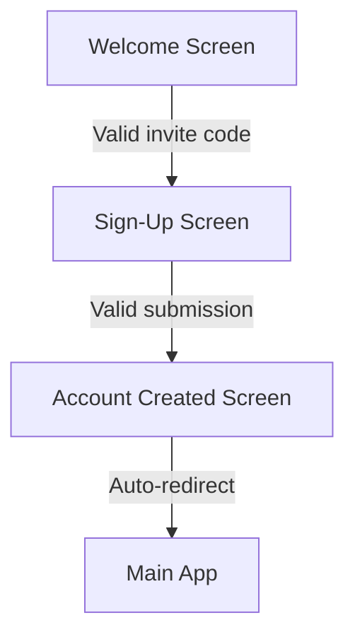
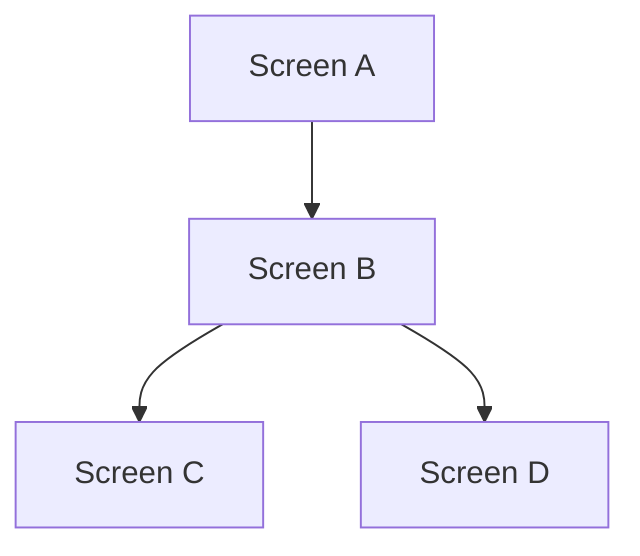

# LIFEY Frontend Screen Structure

> Permanent reference for the frontend-designer agent. Design tokens live in `docs/design/Styles/default.styles`.
> Last updated: 2026-07-18

---

## Screen Inventory

> Only default screens are listed here. Screen variants (error states, loading states, etc.) are documented in the story's traceability matrix but omitted from this index.

| # | Screen Name | Epic / Story | Status | Notes |
|---|------------|-------------|--------|-------|
| 1 | Welcome Screen (`#lifey-welcome`) | EP0002-ST0001 | Designed | Invite code gating — single input + Continue |
| 2 | Sign-Up Screen (`#lifey-signup`) | EP0002-ST0001 | Designed | Email + password + confirm password form |
| 3 | Account Created Screen (`#lifey-account-created`) | EP0002-ST0001 | Designed | Success state with auto-redirect |

---

## Screen Navigation Flow

> Default screen flow only. Variant transitions (error/loading states) are handled within each screen's local state.

---

## Design Rules & Conventions

### Theme

| Token | Value |
|-------|-------|
| Background | `#0D0D1F` (dark) |
| Brand gradient | `linear-gradient(135deg, #7C3AED, #EC4899)` (purple → magenta) |
| Accent text | `#A78BFA` (soft purple) |
| Destructive | `#EF4444` (red) |
| Font | Inter / system-ui |
| Text primary | `#FFFFFF` (white) |
| Text secondary | `rgba(255,255,255,0.5)` or `#9CA3AF` |

> Canonical source for all tokens: `docs/design/Styles/default.styles`

### Screen Dimensions

- **390 × 844 px** (iPhone form factor)
- Outer frame: `s(390,844)` with `clip` and `rd(40)` corner radius
- **Never `s(390,hug)`** — screens must have a fixed 844px height so fill spacers work
- **No phone chrome.** Screens contain only app UI — no status bar (9:41, signal, battery), home indicator, or device mockup elements

### Layout Rules

- 24px side padding on all screens
- Content starts naturally from top (no forced top offset)
- Use `s(fill,fill)` spacers to push CTAs to the bottom
- Text that wraps must use `s(fill,hug)`

### Canvas Structure

All screens live on the **`Lifey`** canvas in `docs/design/Lifey.design`.

### Canvas Layout Rules

- **Different screen types** are stacked vertically (top to bottom). The first screen type starts at Y=0; each subsequent type starts below the previous row.
- **Same-screen variants** (error states, loading states, design alternates) are arranged horizontally (left to right) on the same row. The **default screen** (no error, no message) is always the first (leftmost) element in its row.
- Variants follow the default to the right at X = 430px increments (390px width + 40px gap).
- Screen type rows are separated by a vertical gap (Y = previous row bottom + 40px minimum).

### Design Proposals

New design tokens, component specs, or layout patterns are proposed by the frontend-designer and reviewed by tech-lead via ADRs. Proposal docs go under `docs/architecture/design-proposals/`.

---

## Canvas Reference

| File | Contents | Editable? |
|------|----------|-----------|
| `docs/design/Lifey.design` | All screens + components | ❌ Never edit — Brilliant-managed |
| `docs/design/Styles/default.styles` | Design system tokens | ✅ Yes |
| `docs/design/Assets/` | Image assets (icons, logos, exports) | ✅ Yes |
| `docs/design/Canvas.design` | Scratch canvas config | ❌ Never edit |
| `docs/design/.brilliant/` | Brilliant internal data | ❌ Never edit |
| `docs/reviews/` | Design review reports (output from frontend-review) | ✅ Yes — created by frontend-review agent |

---

## Designed Screens

### Welcome Screen (default)
- **Epic/Story:** EP0002-ST0001
- **Design ref:** `#lifey-welcome`
- **Purpose:** First screen — invite code gating for new users
- **Transitions:** (app open) → Welcome → (valid code) → Sign-Up Screen
- **Key elements:** LIFEY brand icon + wordmark, "Join LIFEY" heading, invite code input, Continue button (primary purple), "Log In" link
- **Variants (row right):** Invalid code error, Expired code error, Used code error

### Sign-Up Screen (default)
- **Epic/Story:** EP0002-ST0001
- **Design ref:** `#lifey-signup`
- **Purpose:** Email + password account creation form
- **Transitions:** Welcome → (valid code) → Sign-Up → (submitted) → Account Created
- **Key elements:** Back button, "Code accepted" indicator, email input, password input (with eye toggle), confirm password input, Create Account button, terms text
- **Variants (row right):** Password too short error, Passwords match error, Email exists error

### Account Created Screen (default)
- **Epic/Story:** EP0002-ST0001
- **Design ref:** `#lifey-account-created`
- **Purpose:** Success confirmation with auto-redirect to main app
- **Transitions:** Sign-Up → (submitted) → Account Created → (auto) → Main App
- **Key elements:** Success checkmark in green circle, "Account created!" heading, "Welcome to LIFEY" subtitle, loading dots animation, "Taking you to the app..." text

---

## Flow Update Template

When updating the navigation flow diagram, add nodes and edges following this pattern:

