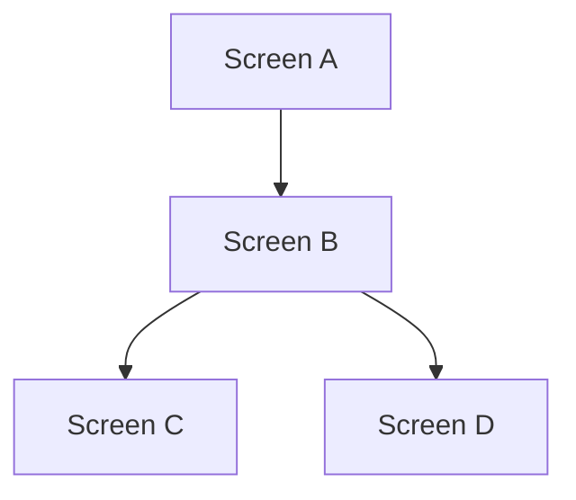

# LIFEY Frontend Screen Structure

> Permanent reference for the frontend-designer agent. Design tokens live in `docs/design/Styles/default.styles`.
> Last updated: 2026-07-18

---

## Screen Inventory

| # | Screen Name | Epic / Story | Status | Notes |
|---|------------|-------------|--------|-------|
|   | *(to be added)* | | | |

---

## Screen Navigation Flow

```mermaid
flowchart TD
    %% Add screens and transitions here as they are designed
```

---

## Design Rules & Conventions

### Theme

| Token | Value |
|-------|-------|
| Background | `#0D0D1F` (dark) |
| Brand gradient | `linear-gradient(135deg, #7C3AED, #EC4899)` (purple → magenta) |
| Accent text | `#A78BFA` (soft purple) |
| Destructive | `#EF4444` (red) |
| Font | Inter / system-ui |
| Text primary | `#FFFFFF` (white) |
| Text secondary | `rgba(255,255,255,0.5)` or `#9CA3AF` |

> Canonical source for all tokens: `docs/design/Styles/default.styles`

### Screen Dimensions

- **390 × 844 px** (iPhone form factor)
- Outer frame: `s(390,844)` with `clip` and `rd(40)` corner radius
- **Never `s(390,hug)`** — screens must have a fixed 844px height so fill spacers work
- **No phone chrome.** Screens contain only app UI — no status bar (9:41, signal, battery), home indicator, or device mockup elements

### Layout Rules

- 24px side padding on all screens
- Content starts naturally from top (no forced top offset)
- Use `s(fill,fill)` spacers to push CTAs to the bottom
- Text that wraps must use `s(fill,hug)`

### Canvas Structure

All screens live on the **`Lifey`** canvas in `docs/design/Lifey.design`.

### Design Proposals

New design tokens, component specs, or layout patterns are proposed by the frontend-designer and reviewed by tech-lead via ADRs. Proposal docs go under `docs/architecture/design-proposals/`.

---

## Canvas Reference

| File | Contents | Editable? |
|------|----------|-----------|
| `docs/design/Lifey.design` | All screens + components | ❌ Never edit — Brilliant-managed |
| `docs/design/Styles/default.styles` | Design system tokens | ✅ Yes |
| `docs/design/Assets/` | Image assets (icons, logos, exports) | ✅ Yes |
| `docs/design/Canvas.design` | Scratch canvas config | ❌ Never edit |
| `docs/design/.brilliant/` | Brilliant internal data | ❌ Never edit |

---

## Screen Template

When adding a new screen, use this format:

```markdown
### Screen Name
- **Epic/Story:** EPxxxx-STxxxx
- **Design ref:** `#lifey-<screen-name>`
- **Purpose:** One-liner of what this screen does
- **Transitions:** Previous screen → This screen → Next screen
```

---

## Flow Update Template

When updating the navigation flow diagram, add nodes and edges following this pattern:


