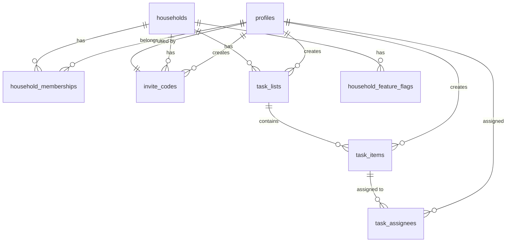
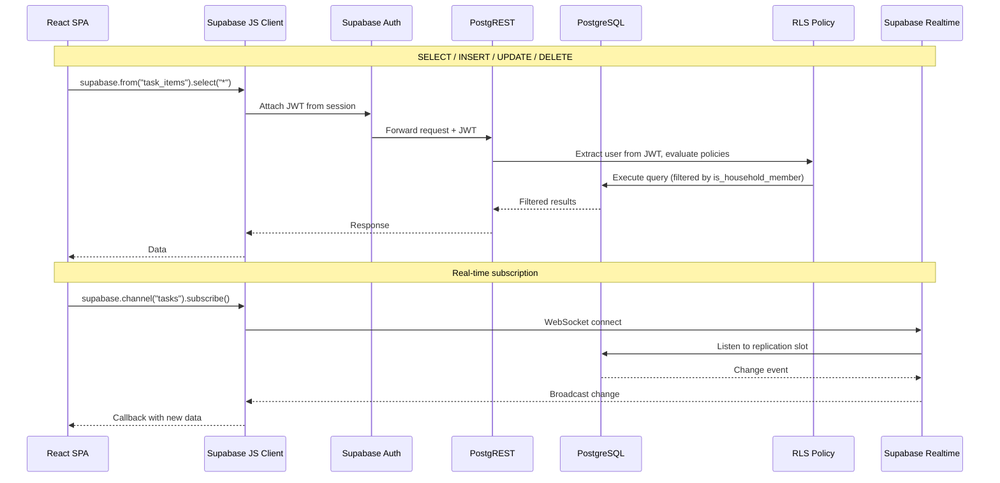

# Data Model — Q3 2026

## Overview

This document defines the PostgreSQL schema for LIFEY's Q3 features. All tables live under the `public` schema in the Supabase PostgreSQL database. Row Level Security (RLS) is the primary access control mechanism.

**Key principles:**
- UUID primary keys for all tables (enables future migration, avoids sequential ID guessing)
- `created_at` / `updated_at` on every table via triggers
- TIMESTAMPTZ for all timestamps (stored in UTC, converted by the client)
- Foreign keys enforced at the database level
- RLS as the single policy enforcement point — no application-level authorization

---

## Entity Relationship



---

## Tables

### profiles

Extends Supabase Auth's built-in `auth.users` table. One row per user, created on sign-up via a database trigger.

```sql
create table public.profiles (
    id            uuid primary key references auth.users(id) on delete cascade,
    display_name  varchar(100) not null,
    avatar_url    text,
    created_at    timestamptz not null default now(),
    updated_at    timestamptz not null default now()
);

-- Auto-create profile on sign-up
create function public.handle_new_user()
returns trigger
language plpgsql
security definer set search_path = ''
as $$
begin
    insert into public.profiles (id, display_name)
    values (new.id, coalesce(new.raw_user_meta_data ->> 'display_name', 'User'));
    return new;
end;
$$;

create trigger on_auth_user_created
    after insert on auth.users
    for each row execute function public.handle_new_user();
```

### households

A shared-life group. Created when a user signs up (personal household) or when a user creates a new household.

```sql
create table public.households (
    id          uuid primary key default gen_random_uuid(),
    name        varchar(100) not null,
    created_by  uuid not null references public.profiles(id),
    created_at  timestamptz not null default now(),
    updated_at  timestamptz not null default now()
);
```

### household_memberships

Join table linking profiles to households with a role. A user can belong to multiple households.

```sql
create table public.household_memberships (
    id            uuid primary key default gen_random_uuid(),
    household_id  uuid not null references public.households(id) on delete cascade,
    profile_id    uuid not null references public.profiles(id) on delete cascade,
    role          varchar(20) not null default 'member' check (role in ('admin', 'member')),
    joined_at     timestamptz not null default now(),
    unique(household_id, profile_id)
);

create index idx_memberships_profile on public.household_memberships(profile_id);
create index idx_memberships_household on public.household_memberships(household_id);
```

### invite_codes

Time-limited codes used to join a household. Once used, they're marked as consumed.

```sql
create table public.invite_codes (
    id            uuid primary key default gen_random_uuid(),
    household_id  uuid not null references public.households(id) on delete cascade,
    code          varchar(20) not null,
    created_by    uuid not null references public.profiles(id),
    used_by       uuid references public.profiles(id),
    used_at       timestamptz,
    expires_at    timestamptz not null,
    created_at    timestamptz not null default now(),
    unique(code)
);

create index idx_invite_codes_household on public.invite_codes(household_id);
```

### password_reset_codes

Stores password reset codes for the code-based forgot password flow. Codes are 6 digits, hashed, with expiry and rate limiting. Used by the `send-reset-code` Supabase Edge Function.

```sql
create table public.password_reset_codes (
    id            uuid primary key default gen_random_uuid(),
    email         text not null,
    code_hash     text not null,
    expires_at    timestamptz not null,
    attempts      int not null default 0,
    created_at    timestamptz not null default now()
);

create index idx_password_reset_codes_email on public.password_reset_codes(email);
```

### task_lists

Containers that hold task items. The list's access scope is determined by which household it belongs to:
- **Personal household** — only you can see and manage this list (you're the sole member)
- **Shared household** — all household members can see and manage this list

```sql
create table public.task_lists (
    id            uuid primary key default gen_random_uuid(),
    household_id  uuid not null references public.households(id) on delete cascade,
    name          varchar(100) not null,
    created_by    uuid not null references public.profiles(id),
    created_at    timestamptz not null default now(),
    updated_at    timestamptz not null default now()
);

create index idx_task_lists_household on public.task_lists(household_id);
create index idx_task_lists_created_by on public.task_lists(created_by);
```

### task_items

Individual to-do items inside a task list. They can be assigned to household members (via `task_assignees`). In personal households the creator is the only assignee option; in shared households, any member can be assigned (default: unassigned).

```sql
create type item_status as enum ('pending', 'completed');

create table public.task_items (
    id            uuid primary key default gen_random_uuid(),
    task_list_id  uuid not null references public.task_lists(id) on delete cascade,
    title         varchar(255) not null,
    description   text,
    due_date      timestamptz,
    status        item_status not null default 'pending',
    created_by    uuid not null references public.profiles(id),
    completed_by  uuid references public.profiles(id),
    completed_at  timestamptz,
    created_at    timestamptz not null default now(),
    updated_at    timestamptz not null default now()
);

create index idx_task_items_list on public.task_items(task_list_id);
create index idx_task_items_status on public.task_items(status);
create index idx_task_items_due_date on public.task_items(due_date);
create index idx_task_items_created_by on public.task_items(created_by);
```

### task_assignees

Many-to-many relationship between task items and profiles. A task item can be assigned to one or more household members.

- In **personal households**: the creator is auto-assigned (only option)
- In **shared households**: any member can be assigned, default is unassigned

```sql
create table public.task_assignees (
    id          uuid primary key default gen_random_uuid(),
    task_id     uuid not null references public.task_items(id) on delete cascade,
    profile_id  uuid not null references public.profiles(id) on delete cascade,
    assigned_at timestamptz not null default now(),
    unique(task_id, profile_id)
);

create index idx_task_assignees_task on public.task_assignees(task_id);
create index idx_task_assignees_profile on public.task_assignees(profile_id);
```

### household_feature_flags

Controls which features are active for each household. Seeded with defaults on household creation.

```sql
create table public.household_feature_flags (
    id            uuid primary key default gen_random_uuid(),
    household_id  uuid not null references public.households(id) on delete cascade,
    feature_key   varchar(50) not null,
    enabled       boolean not null default false,
    unique(household_id, feature_key)
);

create index idx_feature_flags_household on public.household_feature_flags(household_id);

-- Seed defaults on household creation
create function public.seed_feature_flags()
returns trigger
language plpgsql
security definer set search_path = ''
as $$
begin
    insert into public.household_feature_flags (household_id, feature_key, enabled) values
        (new.id, 'todo_lists', true),
        (new.id, 'expenses', false),
        (new.id, 'ai_agent', false),
        (new.id, 'household_chat', false);
    return new;
end;
$$;

create trigger on_household_created
    after insert on public.households
    for each row execute function public.seed_feature_flags();
```

---

## Auto-update `updated_at` trigger

Applied to all tables with an `updated_at` column.

```sql
create or replace function public.set_updated_at()
returns trigger
language plpgsql
security definer set search_path = ''
as $$
begin
    new.updated_at = now();
    return new;
end;
$$;

create trigger set_updated_at_profiles
    before update on public.profiles
    for each row execute function public.set_updated_at();

create trigger set_updated_at_households
    before update on public.households
    for each row execute function public.set_updated_at();

create trigger set_updated_at_task_lists
    before update on public.task_lists
    for each row execute function public.set_updated_at();

create trigger set_updated_at_task_items
    before update on public.task_items
    for each row execute function public.set_updated_at();
```

---

## Row Level Security

RLS is the sole authorization layer. The Supabase JS client sends the JWT with every request; PostgreSQL extracts the user ID and checks household membership before allowing access.

### Helper function

```sql
-- Returns true if the requesting user is a member of the given household
create or replace function public.is_household_member(household_id uuid)
returns boolean
language sql
stable
security definer set search_path = ''
as $$
    select exists (
        select 1
        from public.household_memberships
        where household_memberships.household_id = is_household_member.household_id
          and household_memberships.profile_id = auth.uid()
    );
$$;

-- Returns true if the requesting user is an admin of the given household
create or replace function public.is_household_admin(household_id uuid)
returns boolean
language sql
stable
security definer set search_path = ''
as $$
    select exists (
        select 1
        from public.household_memberships
        where household_memberships.household_id = is_household_admin.household_id
          and household_memberships.profile_id = auth.uid()
          and household_memberships.role = 'admin'
    );
$$;
```

### RLS policies

```sql
-- profiles: users can read/update their own profile only
alter table public.profiles enable row level security;

create policy "Users can read their own profile"
    on public.profiles for select
    using (id = auth.uid());

create policy "Users can update their own profile"
    on public.profiles for update
    using (id = auth.uid())
    with check (id = auth.uid());

-- households: members can read; admins can update
alter table public.households enable row level security;

create policy "Members can view their households"
    on public.households for select
    using (is_household_member(id));

create policy "Admins can update their household"
    on public.households for update
    using (is_household_admin(id))
    with check (is_household_admin(id));

-- household_memberships: members can read; admins can manage
alter table public.household_memberships enable row level security;

create policy "Members can view memberships in their households"
    on public.household_memberships for select
    using (is_household_member(household_id));

create policy "Admins can manage memberships"
    on public.household_memberships for insert
    with check (is_household_admin(household_id));

create policy "Admins can update memberships"
    on public.household_memberships for update
    using (is_household_admin(household_id))
    with check (is_household_admin(household_id));

create policy "Admins can remove members"
    on public.household_memberships for delete
    using (is_household_admin(household_id));

-- invite_codes: members can read and create; only used_by update is automatic
alter table public.invite_codes enable row level security;

create policy "Members can view invite codes"
    on public.invite_codes for select
    using (is_household_member(household_id));

create policy "Admins can create invite codes"
    on public.invite_codes for insert
    with check (is_household_admin(household_id));

create policy "Anyone can use an invite code (mark as used)"
    on public.invite_codes for update
    using (true)
    with check (true);

-- task_lists: members can CRUD
alter table public.task_lists enable row level security;

create policy "Members can view task lists"
    on public.task_lists for select
    using (is_household_member(household_id));

create policy "Members can create task lists"
    on public.task_lists for insert
    with check (is_household_member(household_id));

create policy "Members can update task lists"
    on public.task_lists for update
    using (is_household_member(household_id))
    with check (is_household_member(household_id));

create policy "Members can delete task lists"
    on public.task_lists for delete
    using (is_household_member(household_id));

-- task_items: members can CRUD (access scoped via task_list -> household)
alter table public.task_items enable row level security;

create policy "Members can view task items"
    on public.task_items for select
    using (exists (
        select 1 from public.task_lists
        where task_lists.id = task_items.task_list_id
          and is_household_member(task_lists.household_id)
    ));

create policy "Members can create task items"
    on public.task_items for insert
    with check (exists (
        select 1 from public.task_lists
        where task_lists.id = task_items.task_list_id
          and is_household_member(task_lists.household_id)
    ));

create policy "Members can update task items"
    on public.task_items for update
    using (exists (
        select 1 from public.task_lists
        where task_lists.id = task_items.task_list_id
          and is_household_member(task_lists.household_id)
    ))
    with check (exists (
        select 1 from public.task_lists
        where task_lists.id = task_items.task_list_id
          and is_household_member(task_lists.household_id)
    ));

create policy "Members can delete task items"
    on public.task_items for delete
    using (exists (
        select 1 from public.task_lists
        where task_lists.id = task_items.task_list_id
          and is_household_member(task_lists.household_id)
    ));

-- task_assignees: access scoped via task_item -> task_list -> household
alter table public.task_assignees enable row level security;

create policy "Members can view assignees"
    on public.task_assignees for select
    using (exists (
        select 1 from public.task_items
        join public.task_lists on task_lists.id = task_items.task_list_id
        where task_items.id = task_assignees.task_id
          and is_household_member(task_lists.household_id)
    ));

create policy "Members can manage assignees"
    on public.task_assignees for insert
    with check (exists (
        select 1 from public.task_items
        join public.task_lists on task_lists.id = task_items.task_list_id
        where task_items.id = task_assignees.task_id
          and is_household_member(task_lists.household_id)
    ));

create policy "Members can remove assignees"
    on public.task_assignees for delete
    using (exists (
        select 1 from public.task_items
        join public.task_lists on task_lists.id = task_items.task_list_id
        where task_items.id = task_assignees.task_id
          and is_household_member(task_lists.household_id)
    ));

-- household_feature_flags: members can read; admins can toggle
alter table public.household_feature_flags enable row level security;

create policy "Members can view feature flags"
    on public.household_feature_flags for select
    using (is_household_member(household_id));

create policy "Admins can toggle feature flags"
    on public.household_feature_flags for update
    using (is_household_admin(household_id))
    with check (is_household_admin(household_id));
```

---

## Supabase Integration Notes

### How the SPA talks to the database



### Auth flow note

The `auth.uid()` function used in RLS policies is provided by Supabase. It returns the user ID from the JWT attached to the request. The Supabase JS client handles JWT attachment automatically — the SPA never manually constructs or inspects tokens.

---

## Migration Order

When applying to a fresh Supabase project:

1. Create `profiles` table + trigger (required before all other tables)
2. Create `households` table
3. Create `household_memberships` table
4. Create `invite_codes` table
5. Create `password_reset_codes` table
6. Create `task_lists` table
7. Create `task_items` table
8. Create `task_assignees` table
9. Create `household_feature_flags` table + trigger
10. Create `set_updated_at` function and apply triggers
11. Create helper functions (`is_household_member`, `is_household_admin`)
12. Enable RLS and apply policies

All SQL should be written as a single migration file per table, with an accompanying rollback script.
