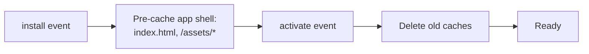

# Service Worker Strategy — LIFEY PWA

> **Audience:** Developers
> **Last updated:** 2026-07-14
> **Related decisions:** [ADR-0002](../adr/0002-installable-spa-architecture.md), [ADR-0004](../adr/0004-state-management-and-offline-strategy.md), [ADR-0007](../adr/0007-deploy-host.md)

---

## Overview

LIFEY uses a service worker for two purposes:

1. **App shell caching** — the static assets (HTML, JS, CSS) that make up the UI framework
2. **Push notifications** — receiving and displaying push messages (Q4)

**Data caching** is NOT the service worker's responsibility. All server data (households, task lists, task items, profiles) is cached by **TanStack Query's `persistQueryClient`** into IndexedDB per [ADR-0004](../adr/0004-state-management-and-offline-strategy.md).

This boundary is critical — the SW caches the **container**, TanStack Query caches the **contents**.

---

## Caching Boundary

```
                    SW caches this         TanStack Query caches this
                    ──────────────         ──────────────────────────
  index.html         ✅ cache-first        ❌ never hits SW
  /assets/*.js       ✅ cache-first        ❌ never hits SW
  /assets/*.css      ✅ cache-first        ❌ never hits SW
  /assets/*.svg      ✅ cache-first        ❌ never hits SW

  Supabase API       ❌ never cached       ✅ persistQueryClient → IndexedDB
  (every request)
```

**Why not cache API responses in the SW?**
- TanStack Query provides finer-grained control (per-query TTL, background refetch, optimistic updates)
- API responses contain sensitive household data — the SW's Cache Storage is less auditable than IndexedDB
- Avoids two cache layers competing (SW Cache + TQ Query Cache)

---

## Caching Strategy: Cache-First for Assets

The service worker uses a **cache-first** strategy for static assets:

```
Request for /assets/main-abc123.js
         │
         ▼
   ┌────────────┐
   │  In cache?  │
   └─────┬──────┘
     ✅  │          ❌
         ▼          ▼
   Serve from    Fetch from
   cache         network
                 ┌─────────┐
                 │ Cache &  │
                 │ respond  │
                 └─────────┘
```

This is safe because:

- Asset filenames contain content hashes (`main.7a8b9c.js`) — cache is automatically invalidated on rebuild
- The service worker never serves stale HTML/JS/CSS because a new build produces new filenames
- The `_headers` file sets `Cache-Control: public, max-age=31536000, immutable` for `/assets/*`

For `index.html`:

```
Request for index.html
         │
         ▼
   ┌────────────┐
   │  In cache?  │
   └─────┬──────┘
     ✅  │          ❌
         ▼          ▼
   Serve from    Fetch from
   cache         network
                 ┌─────────┐
                 │ Cache &  │
                 │ respond  │
                 └─────────┘
```

`index.html` has `Cache-Control: no-cache` to ensure the browser checks for updates, but the SW serves it from cache for offline access. On the next online visit, the SW fetches the latest version in the background.

---

## Service Worker Lifecycle

### Installation



- On `install`, the SW fetches and caches the core app shell files
- The `vite-plugin-pwa` generates the precache manifest automatically from the Vite build output

### Activation

- On `activate`, the SW deletes any caches from previous versions
- After activation, the SW takes control of all open clients (`clients.claim()`)

### Updates

- When a new build is deployed, `vite-plugin-pwa` generates a new service worker with a different content hash
- The browser detects the new SW, downloads it in the background, and waits for the next navigation
- On the user's next visit, the new SW activates and replaces the old cache

There is **no forced update prompt** in Q3 — the new version loads on the user's next visit. This can be revisited if we need to push critical updates.

---

## Push Notification Support (Q4)

The service worker will also handle push notifications in Q4:

```
Server sends push → SW receives `push` event
                  → Shows notification even if app is closed
                  → On click, opens /household/:id/tasks
```

The push subscription is registered via `PushManager.subscribe()` and stored in the Supabase `push_subscriptions` table. This is deferred — no push logic in Q3.

---

## Configuration (vite-plugin-pwa)

```typescript
// vite.config.ts
import { VitePWA } from "vite-plugin-pwa";

export default defineConfig({
  plugins: [
    VitePWA({
      registerType: "autoUpdate",
      includeAssets: ["favicon.svg", "apple-touch-icon.png"],
      manifest: {
        name: "LIFEY",
        short_name: "LIFEY",
        description: "Household management for your everyday life",
        theme_color: "#ffffff",
        background_color: "#ffffff",
        display: "standalone",
        scope: "/",
        start_url: "/",
        icons: [
          { src: "/pwa-192x192.png", sizes: "192x192", type: "image/png" },
          { src: "/pwa-512x512.png", sizes: "512x512", type: "image/png" },
          { src: "/pwa-512x512.png", sizes: "512x512", type: "image/png", purpose: "maskable" },
        ],
      },
      workbox: {
        globPatterns: ["**/*.{js,css,html,svg,png,jpg}"],
        runtimeCaching: [
          // Only cache static assets — no API routes
        ],
      },
    }),
  ],
});
```

### What this config does

| Setting | Value | Effect |
|---------|-------|--------|
| `registerType` | `"autoUpdate"` | New SW activates on next visit automatically |
| `display` | `"standalone"` | Opens without browser chrome |
| `scope` | `"/"` | SW controls all pages under the domain |
| `globPatterns` | JS, CSS, HTML, SVG, PNG, JPG | Pre-cached on install |
| `runtimeCaching` | Empty | No runtime caching — TanStack Query handles data |

---

## Key Files

| File | Purpose | Source |
|------|---------|--------|
| `vite.config.ts` | SW generation config via `vite-plugin-pwa` | Committed |
| `public/pwa-192x192.png` | PWA icon (192×192) | Committed |
| `public/pwa-512x512.png` | PWA icon (512×512) | Committed |
| `public/favicon.svg` | Favicon / SVG icon | Committed |
| `public/apple-touch-icon.png` | iOS home screen icon | Committed |
| Generated SW | Auto-generated by `vite-plugin-pwa` | Gitignored (in `dist/`) |

---

## Q3 Limitations

| Limitation | Reason | Future improvement |
|-----------|--------|-------------------|
| No offline writes | SW only caches reads; TanStack Query persistQueryClient is read-only | Q4: SW Background Sync for mutation queue |
| No forced update | New SW activates on next visit | Add update prompt if needed |
| No push notifications | Push logic requires backend | Q4: Supabase Edge Function + Web Push API |
