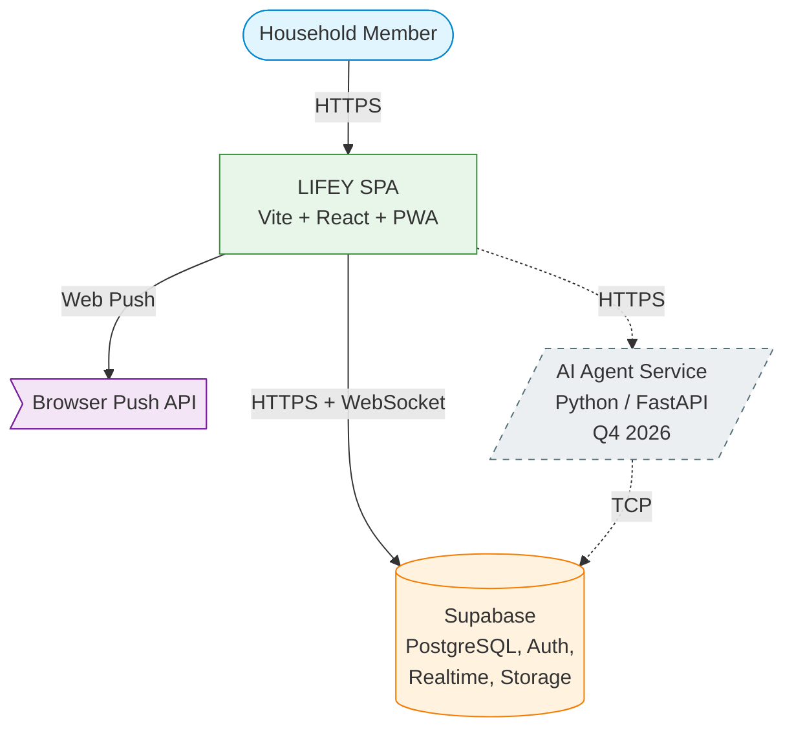

# C1 — System Context Diagram

> **Audience:** Everyone (including non-technical)
> **Last updated:** 2026-07-14
> **Architecture decision:** [ADR-0002](../adr/0002-installable-spa-architecture.md)

## Key relationships

| From | To | Protocol | Purpose |
|------|----|----------|---------|
| Household Member | LIFEY SPA | HTTPS | Uses the app via browser or installed PWA |
| LIFEY SPA | Supabase | HTTPS + WebSocket | Auth, database queries, real-time subscriptions, file storage |
| LIFEY SPA | Browser Push API | Web Push | Push notifications via service worker |
| LIFEY SPA | AI Agent Service (future) | HTTPS | API calls for AI features (Q4 2026) |
| AI Agent Service (future) | Supabase | TCP | Direct database access via connection pool |

## Notes

- **Supabase** is a single vendor providing PostgreSQL, Auth, Realtime, and Storage as one managed service
- **Browser Push API** is the browser's built-in push mechanism — no third-party push service needed
- **AI Agent Service** is deferred to Q4 2026 per ADR-0001 (shown with dashed lines)
- Future native mobile apps will connect to the same Supabase backend
