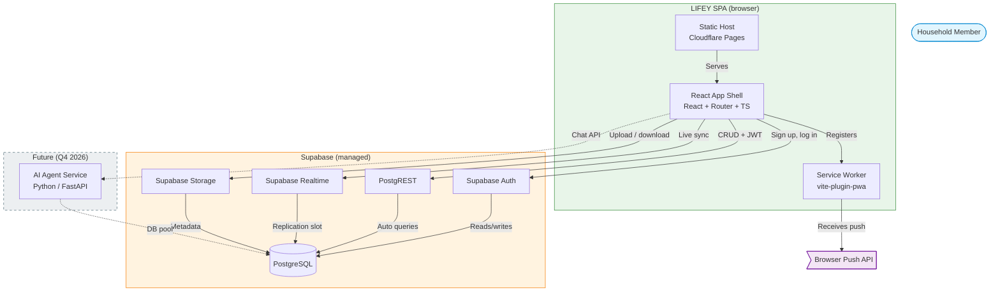

# C2 — Container Diagram

> **Audience:** Developers, ops
> **Last updated:** 2026-07-14
> **Architecture decision:** [ADR-0002](../adr/0002-installable-spa-architecture.md)



## Data flow

### Authentication flow

```
Member → React Shell → invite code gate → enter email → magic link sent
                     → Click magic link → Supabase Auth authenticates
                     → Returns JWT token (stored in IndexedDB via persistQueryClient)
                     → Token attached to all subsequent requests
                     → RLS policies enforce per-household data isolation
```

### Real-time flow (e.g., to-do list updates)

```
Member A adds task → React Shell → PostgREST (INSERT with JWT)
                      → PostgreSQL (RLS validates household membership)
                      → Replication slot triggers Realtime broadcast
                      → Member B's React Shell receives WebSocket event
                      → UI updates
```

### Push notification flow

```
Service Worker registers push subscription → stored in Supabase DB
When task assigned → (Supabase Edge Function or future backend)
  → sends push via Web Push API → Service Worker receives
  → Shows notification, even if app is closed
```

## Notes

- There is **no custom API server** — PostgREST generates the REST API directly from the database schema
- Row Level Security (RLS) policies enforce multi-tenant data isolation — every query includes the JWT, RLS checks household membership
- The AI Agent Service will connect directly to the same PostgreSQL database (not through Supabase APIs) per ADR-0001 compliance rules
- Future native mobile apps will use the same Supabase JS client and endpoints
