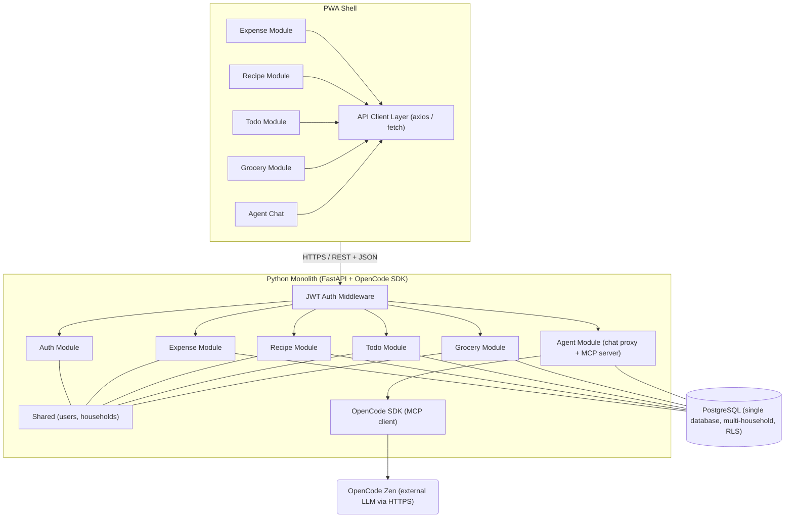
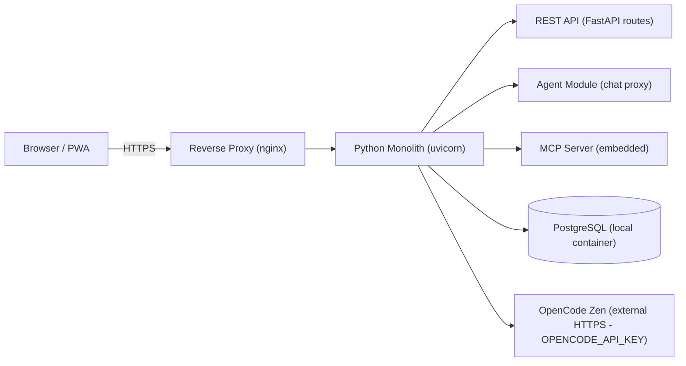

# ARCHITECTURE — LIFEY

## System Diagram (Logical)



## Frontend Architecture

| Concern | Choice |
|---------|--------|
| Framework | React (latest stable) |
| Language | TypeScript (strict) |
| Build tool | Vite |
| Routing | React Router v7+ |
| State management | React Query (server state) + Zustand (client state) |
| PWA | vite-plugin-pwa (Workbox) |
| HTTP client | axios |
| Styling | Tailwind CSS |
| Component library | None — custom components; Radix UI primitives if needed |
| Form handling | React Hook Form + Zod |

### Module structure (frontend)

```
src/
  features/
    auth/
    expense/
    recipe/
    todo/
    grocery/
    household/
    agent/        # Chat UI, message history, conversation state
  shared/        # UI primitives, hooks, utils, types
  api/           # API client configuration
  router/        # route definitions
```

## Backend Architecture

| Concern | Choice |
|---------|--------|
| Framework | FastAPI (Python 3.12+) |
| Language | Python 3.12+ |
| AI Agent SDK | OpenCode SDK (openframework) — agent orchestration, LLM access via OpenCode Zen |
| MCP Protocol | MCP Python SDK — embedded MCP server exposes domain tools + read-only SQL to the agent |
| ORM | SQLAlchemy 2.0 (async) |
| Migrations | Alembic |
| Validation | Pydantic v2 |
| Auth | PyJWT (RS256 or HS256) — self-managed |
| Password hashing | bcrypt (passlib) |
| API style | RESTful, versioned under `/api/v1/` |
| Background tasks | FastAPI BackgroundTasks / Celery (if needed later) |

### Module structure (backend)

```
app/
  modules/
    auth/
    expense/
    recipe/
    todo/
    grocery/
    household/
    agent/        # Chat proxy, MCP server, agent orchestration
  shared/         # base CRUD, pagination, error handling, DB session
  core/           # config, security, dependencies
  migrations/     # Alembic
```

## Communication

- **Frontend → Backend (standard):** REST over HTTPS. JSON request/response bodies. JWT in `Authorization: Bearer <token>` header.
- **Frontend → Backend (agent chat):** REST streaming endpoint `POST /api/v1/agent/chat` — sends user message, receives agent response stream (SSE-style polling or chunked response). No WebSockets.
- **Backend (Agent Module) → OpenCode Zen:** HTTPS. The OpenCode SDK manages the LLM connection. `OPENCODE_API_KEY` environment variable authenticates.
- **Backend (MCP Server) → Backend (DB):** The embedded MCP server shares the same database session factory and enforces household scoping on every tool invocation.
- **No WebSockets.** No server-sent events (for standard API). Agent streaming uses chunked HTTP responses.
- **No GraphQL.** No tRPC.

## Data Isolation

- Every table carries a `household_id` foreign key.
- All queries are scoped by the authenticated user's household. No cross-household data leakage.
- PostgreSQL row-level security (RLS) is used as a defence-in-depth layer; application-layer scoping remains the primary gate.

## MCP Server (Embedded)

The MCP server runs inside the same Python process as FastAPI. It does not listen on a separate port — the OpenCode SDK agent connects to it via in-process MCP (StdioServerParameters or equivalent in-process bridge).

### Tool Categories

| Category | Pattern | Examples |
|----------|---------|---------|
| **Domain tools (write)** | Named tools for create/update/delete | `agent_create_todo`, `agent_add_grocery_item`, `agent_create_expense` |
| **Read-only SQL** | Raw SQL queries with explicit household filter | `agent_query_sql(household_id, sql)` — SELECT only, enforced at the tool level |

All tools receive `household_id` as the first parameter (extracted from the authenticated user on the REST side; passed explicitly from the agent). The MCP server validates that every SQL query is a SELECT statement before execution.

### Tool Naming

- Prefix: `agent_`
- Action verb + domain noun: `agent_get_expenses`, `agent_add_grocery_item`, `agent_update_todo`
- SQL tool: `agent_query_sql`

## Auth Flow

1. Registration creates a user within a household. First user creates the household; subsequent users join via invite token.
2. Login returns a signed JWT (access + refresh token pair).
3. Access token lives in memory (JS variable). Refresh token in `httpOnly` cookie or local storage.
4. Every API request validates the JWT and extracts `user_id` + `household_id`.

## Deployment Topology



Single-server deployable with one external dependency (OpenCode Zen). No microservices, no message broker, no cache layer (unless profiling proves a bottleneck).

## Agent Chat Flow

1. User types a message in the Agent Chat UI (frontend)
2. Frontend sends `POST /api/v1/agent/chat` with `{ message, conversation_id? }`
3. Backend Agent Module receives the message, retrieves conversation history, and calls the OpenCode SDK agent
4. The OpenCode agent receives the system prompt (from `app/modules/agent/prompt.md`) and conversation context
5. The agent invokes MCP tools (domain tools for writes, SQL for reads) as needed — each call is scoped to the user's `household_id`
6. MCP tools execute against PostgreSQL and return results to the agent
7. The agent formulates a natural-language response streamed back to the frontend
8. The conversation (messages only) is persisted in the `agent_conversations` and `agent_messages` tables
