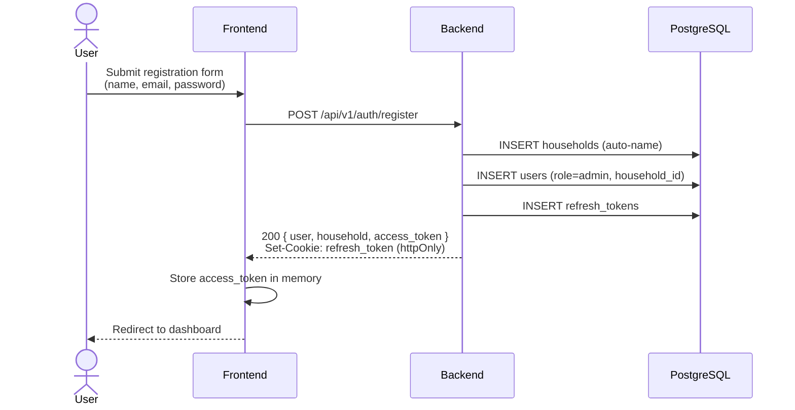
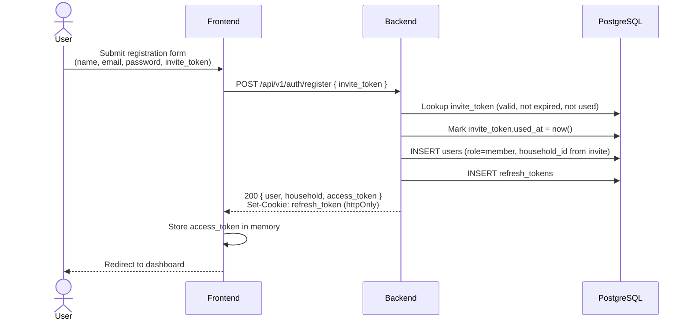
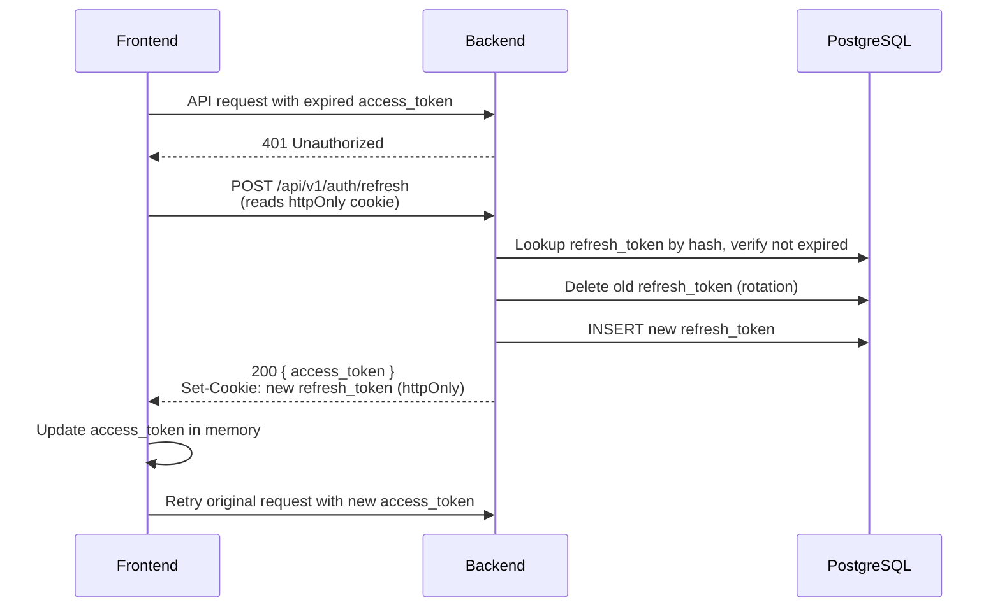
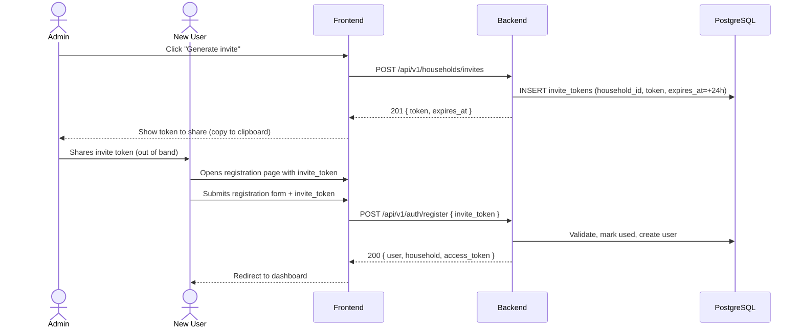

# DSN-001: Auth & Household

**Linked to:** `SPEC-001` | **Use cases:** `SPEC-001:US-001`, `SPEC-001:US-002`, `SPEC-001:US-003`, `SPEC-001:US-004`, `SPEC-001:US-005`, `SPEC-001:US-006`, `SPEC-001:US-007`

## 1. Architecture Map

### Frontend components involved
- `src/features/auth/` — `RegisterPage`, `LoginPage`, `ResetPasswordPage`, `RequestResetPage`
- `src/features/household/` — `MembersPage`, `InvitePage`
- `src/shared/auth.ts` — in-memory access token store (`zustand` store or module-level variable)
- `src/api/client.ts` — axios response interceptor: 401 → call `/auth/refresh` → retry
- `src/router/` — route guards: redirect to `/login` if unauthenticated

### Backend modules involved
- `app/modules/auth/` — registration, login, logout, token refresh, password reset
- `app/modules/household/` — invite generation, member list, member removal
- `app/core/security.py` — JWT create/verify, bcrypt hash/verify
- `app/core/dependencies.py` — `get_current_user`, `require_admin`
- `app/core/exceptions.py` — `AppException` hierarchy
- `app/shared/base.py` — `Base`, `TimestampMixin`, `HouseholdMixin`
- `app/shared/schemas.py` — `APIResponse`, `PaginatedResponse`
- `app/shared/pagination.py` — `PaginationParams`, `paginate`

### New files to create

**Backend:**
- `app/modules/auth/__init__.py`
- `app/modules/auth/models.py`
- `app/modules/auth/schemas.py`
- `app/modules/auth/services.py`
- `app/modules/auth/router.py`
- `app/modules/household/__init__.py`
- `app/modules/household/models.py`
- `app/modules/household/schemas.py`
- `app/modules/household/services.py`
- `app/modules/household/router.py`

**Frontend:**
- `src/features/auth/RegisterPage.tsx`
- `src/features/auth/LoginPage.tsx`
- `src/features/auth/ResetPasswordPage.tsx`
- `src/features/auth/RequestResetPage.tsx`
- `src/features/auth/hooks.ts`
- `src/features/auth/types.ts`
- `src/features/household/MembersPage.tsx`
- `src/features/household/InvitePage.tsx`
- `src/features/household/hooks.ts`
- `src/features/household/types.ts`
- `src/shared/auth.ts`

### Data flow diagrams

**Registration flow (first user):**


**Registration flow (invited user):**


**Token refresh flow:**


**Invite + join flow:**


## 2. API / Data Contracts

### Endpoints

#### POST /api/v1/auth/register

| Method | Path | Auth | Request Body | Response (200) | Errors |
|--------|------|------|-------------|----------------|--------|
| POST | `/api/v1/auth/register` | No | `RegisterRequest` | `RegisterResponse` | 400, 409 |

**Request:**
```json
{
  "name": "string (1-100 chars)",
  "email": "string (email format)",
  "password": "string (min 8 chars)",
  "invite_token": "string | null"
}
```

**Pydantic:**
```python
class RegisterRequest(BaseModel):
    name: str = Field(..., min_length=1, max_length=100)
    email: str = Field(..., pattern=r"^[a-zA-Z0-9_.+-]+@[a-zA-Z0-9-]+\.[a-zA-Z0-9-.]+$")
    password: str = Field(..., min_length=8)
    invite_token: str | None = None
```

**TypeScript:**
```typescript
export interface RegisterRequest {
  name: string
  email: string
  password: string
  invite_token?: string | null
}
```

**Response (200):**
```json
{
  "success": true,
  "data": {
    "user": { "id": 1, "name": "string", "email": "string", "role": "admin" },
    "household": { "id": 1, "name": "string" },
    "access_token": "string"
  },
  "error": null
}
```
Refresh token is set as an `httpOnly` cookie named `refresh_token` with `Path=/api/v1/auth`, `HttpOnly`, `Secure` (in production), `SameSite=Lax`, `Max-Age=2592000` (30 days).

**Pydantic:**
```python
class UserOut(BaseModel):
    id: int
    name: str
    email: str
    role: str  # "admin" | "member"

class HouseholdOut(BaseModel):
    id: int
    name: str

class RegisterResponseData(BaseModel):
    user: UserOut
    household: HouseholdOut
    access_token: str

class RegisterResponse(BaseModel):
    success: bool = True
    data: RegisterResponseData
    error: None = None
```

**TypeScript:**
```typescript
export interface UserOut {
  id: number
  name: string
  email: string
  role: 'admin' | 'member'
}

export interface HouseholdOut {
  id: number
  name: string
}

export interface RegisterResponseData {
  user: UserOut
  household: HouseholdOut
  access_token: string
}
```

**Errors:**
| HTTP | Code | When |
|------|------|------|
| 409 | `CONFLICT` | Email already registered |
| 400 | `VALIDATION_ERROR` | Invalid invite token (expired, already used, or not found) |
| 422 | `VALIDATION_ERROR` | Pydantic validation failure |

#### POST /api/v1/auth/login

| Method | Path | Auth | Request Body | Response (200) | Errors |
|--------|------|------|-------------|----------------|--------|
| POST | `/api/v1/auth/login` | No | `LoginRequest` | `LoginResponse` | 401 |

**Request:**
```json
{
  "email": "string",
  "password": "string"
}
```

**Pydantic:**
```python
class LoginRequest(BaseModel):
    email: str
    password: str
```

**TypeScript:**
```typescript
export interface LoginRequest {
  email: string
  password: string
}
```

**Response (200):**
Same shape as `RegisterResponseData` — `{ user, household, access_token }`. Refresh token in `httpOnly` cookie.

**Errors:**
| HTTP | Code | When |
|------|------|------|
| 401 | `UNAUTHORIZED` | Invalid email or password |

#### POST /api/v1/auth/logout

| Method | Path | Auth | Request Body | Response (200) | Errors |
|--------|------|------|-------------|----------------|--------|
| POST | `/api/v1/auth/logout` | Yes | — | `{ success: true, data: { message } }` | 401 |

**Response (200):**
```json
{
  "success": true,
  "data": { "message": "Logged out successfully" },
  "error": null
}
```
Clears refresh token cookie (`Set-Cookie: refresh_token=; Max-Age=0; Path=/api/v1/auth; HttpOnly`).
Also deletes the refresh token from DB.

#### POST /api/v1/auth/refresh

| Method | Path | Auth | Request Body | Response (200) | Errors |
|--------|------|------|-------------|----------------|--------|
| POST | `/api/v1/auth/refresh` | Cookie | — | `RefreshResponse` | 401 |

No request body. Reads refresh token from `httpOnly` cookie named `refresh_token`.

**Pydantic:**
```python
class RefreshResponseData(BaseModel):
    access_token: str
```

**Response (200):**
```json
{
  "success": true,
  "data": { "access_token": "string" },
  "error": null
}
```
New refresh token is rotated: old one is deleted, new one is inserted and set as cookie.

**Errors:**
| HTTP | Code | When |
|------|------|------|
| 401 | `UNAUTHORIZED` | Missing, expired, or invalid refresh token |

#### POST /api/v1/auth/reset-password/request

| Method | Path | Auth | Request Body | Response (200) | Errors |
|--------|------|------|-------------|----------------|--------|
| POST | `/api/v1/auth/reset-password/request` | No | `ResetPasswordRequest` | `{ success, data: { message, reset_token? } }` | — |

**Request:**
```json
{
  "email": "string"
}
```

**Pydantic:**
```python
class ResetPasswordRequest(BaseModel):
    email: str
```

**Response (200):**
Always returns success (to prevent email enumeration). In development, includes `reset_token` in the response body.
```json
{
  "success": true,
  "data": {
    "message": "If the email exists, a reset link has been sent.",
    "reset_token": "string | null"
  },
  "error": null
}
```

#### POST /api/v1/auth/reset-password/confirm

| Method | Path | Auth | Request Body | Response (200) | Errors |
|--------|------|------|-------------|----------------|--------|
| POST | `/api/v1/auth/reset-password/confirm` | No | `ResetPasswordConfirm` | `{ success, data: { message } }` | 400, 404 |

**Request:**
```json
{
  "token": "string",
  "new_password": "string (min 8 chars)"
}
```

**Pydantic:**
```python
class ResetPasswordConfirm(BaseModel):
    token: str
    new_password: str = Field(..., min_length=8)
```

**Response (200):**
```json
{
  "success": true,
  "data": { "message": "Password updated successfully" },
  "error": null
}
```

**Errors:**
| HTTP | Code | When |
|------|------|------|
| 400 | `VALIDATION_ERROR` | Token expired or already used |
| 404 | `NOT_FOUND` | Token not found |

#### GET /api/v1/households/members

| Method | Path | Auth | Query Params | Response (200) | Errors |
|--------|------|------|-------------|----------------|--------|
| GET | `/api/v1/households/members` | Yes | `page`, `page_size`, `sort_by`, `sort_order` | `PaginatedResponse<MemberOut>` | 401 |

**Query params:** `?page=1&page_size=20&sort_by=created_at&sort_order=desc`

**Pydantic:**
```python
class MemberOut(BaseModel):
    id: int
    name: str
    email: str
    role: str  # "admin" | "member"
    created_at: datetime
```

**TypeScript:**
```typescript
export interface MemberOut {
  id: number
  name: string
  email: string
  role: 'admin' | 'member'
  created_at: string  // ISO 8601
}
```

**Response (200):**
```json
{
  "success": true,
  "data": {
    "items": [ { "id": 1, "name": "...", "email": "...", "role": "admin", "created_at": "2026-01-01T00:00:00Z" } ],
    "total": 1,
    "page": 1,
    "page_size": 20,
    "pages": 1
  },
  "error": null
}
```

**Errors:**
| HTTP | Code | When |
|------|------|------|
| 401 | `UNAUTHORIZED` | Not authenticated |

#### POST /api/v1/households/invites

| Method | Path | Auth | Request Body | Response (201) | Errors |
|--------|------|------|-------------|----------------|--------|
| POST | `/api/v1/households/invites` | Yes (admin) | — | `InviteResponse` | 401, 403 |

No request body.

**Pydantic:**
```python
class InviteResponseData(BaseModel):
    token: str
    expires_at: datetime

class InviteResponse(BaseModel):
    success: bool = True
    data: InviteResponseData
    error: None = None
```

**Response (201):**
```json
{
  "success": true,
  "data": {
    "token": "a1b2c3d4-e5f6-...",
    "expires_at": "2026-01-02T00:00:00Z"
  },
  "error": null
}
```

**Errors:**
| HTTP | Code | When |
|------|------|------|
| 403 | `FORBIDDEN` | Non-admin user |
| 401 | `UNAUTHORIZED` | Not authenticated |

#### DELETE /api/v1/households/members/{user_id}

| Method | Path | Auth | Request Body | Response (200) | Errors |
|--------|------|------|-------------|----------------|--------|
| DELETE | `/api/v1/households/members/{user_id}` | Yes (admin) | — | `{ success: true, data: { message } }` | 401, 403, 404, 409 |

**Response (200):**
```json
{
  "success": true,
  "data": { "message": "Member removed" },
  "error": null
}
```

**Errors:**
| HTTP | Code | When |
|------|------|------|
| 403 | `FORBIDDEN` | Non-admin user, or trying to remove self |
| 404 | `NOT_FOUND` | User not found in this household |
| 409 | `CONFLICT` | Removing the last admin |

### Data Model

#### Table: `households`

| Column | Type | Constraints |
|--------|------|-------------|
| id | `int` | PK, autoincrement |
| name | `varchar(100)` | NOT NULL |
| created_at | `datetime` | NOT NULL, default now() |
| updated_at | `datetime` | NOT NULL, default now(), onupdate now() |

**SQLAlchemy:**
```python
class HouseholdModel(Base, TimestampMixin):
    __tablename__ = "households"

    name: Mapped[str] = mapped_column(String(100), nullable=False)
    # id, created_at, updated_at from TimestampMixin
```

#### Table: `users`

| Column | Type | Constraints |
|--------|------|-------------|
| id | `int` | PK, autoincrement |
| household_id | `int` | FK → households.id, NOT NULL |
| email | `varchar(255)` | NOT NULL, UNIQUE |
| password_hash | `varchar(255)` | NOT NULL |
| name | `varchar(100)` | NOT NULL |
| role | `varchar(20)` | NOT NULL, default 'member', CHECK IN ('admin', 'member') |
| created_at | `datetime` | NOT NULL, default now() |
| updated_at | `datetime` | NOT NULL, default now(), onupdate now() |

**SQLAlchemy:**
```python
class UserModel(Base, TimestampMixin, HouseholdMixin):
    __tablename__ = "users"

    email: Mapped[str] = mapped_column(String(255), unique=True, nullable=False)
    password_hash: Mapped[str] = mapped_column(String(255), nullable=False)
    name: Mapped[str] = mapped_column(String(100), nullable=False)
    role: Mapped[str] = mapped_column(String(20), nullable=False, default="member")
```

#### Table: `invite_tokens`

| Column | Type | Constraints |
|--------|------|-------------|
| id | `int` | PK, autoincrement |
| household_id | `int` | FK → households.id, NOT NULL |
| token | `varchar(255)` | NOT NULL, UNIQUE |
| expires_at | `datetime` | NOT NULL |
| used_at | `datetime` | nullable |
| created_at | `datetime` | NOT NULL, default now() |
| updated_at | `datetime` | NOT NULL, default now(), onupdate now() |

**SQLAlchemy:**
```python
class InviteTokenModel(Base, TimestampMixin, HouseholdMixin):
    __tablename__ = "invite_tokens"

    token: Mapped[str] = mapped_column(String(255), unique=True, nullable=False)
    expires_at: Mapped[datetime] = mapped_column(nullable=False)
    used_at: Mapped[datetime | None] = mapped_column(nullable=True)
```

#### Table: `refresh_tokens`

| Column | Type | Constraints |
|--------|------|-------------|
| id | `int` | PK, autoincrement |
| user_id | `int` | FK → users.id, NOT NULL |
| household_id | `int` | FK → households.id, NOT NULL |
| token_hash | `varchar(255)` | NOT NULL |
| expires_at | `datetime` | NOT NULL |
| created_at | `datetime` | NOT NULL, default now() |
| updated_at | `datetime` | NOT NULL, default now(), onupdate now() |

**Design note:** `household_id` is included for strict compliance with `CONVENTIONS.md §6` (every table carries `household_id`). It enables household-scoped token invalidation when a member is removed.

**SQLAlchemy:**
```python
class RefreshTokenModel(Base, TimestampMixin, HouseholdMixin):
    __tablename__ = "refresh_tokens"

    user_id: Mapped[int] = mapped_column(ForeignKey("users.id"), nullable=False)
    token_hash: Mapped[str] = mapped_column(String(255), nullable=False)
    expires_at: Mapped[datetime] = mapped_column(nullable=False)
```

#### Table: `password_reset_tokens`

| Column | Type | Constraints |
|--------|------|-------------|
| id | `int` | PK, autoincrement |
| user_id | `int` | FK → users.id, NOT NULL |
| household_id | `int` | FK → households.id, NOT NULL |
| token | `varchar(255)` | NOT NULL, UNIQUE |
| expires_at | `datetime` | NOT NULL (TTL: 1 hour) |
| used_at | `datetime` | nullable |
| created_at | `datetime` | NOT NULL, default now() |
| updated_at | `datetime` | NOT NULL, default now(), onupdate now() |

**Design note:** Separate table from `invite_tokens` — different TTL (1 hour vs 24 hours), different lifecycle.

**SQLAlchemy:**
```python
class PasswordResetTokenModel(Base, TimestampMixin, HouseholdMixin):
    __tablename__ = "password_reset_tokens"

    user_id: Mapped[int] = mapped_column(ForeignKey("users.id"), nullable=False)
    token: Mapped[str] = mapped_column(String(255), unique=True, nullable=False)
    expires_at: Mapped[datetime] = mapped_column(nullable=False)
    used_at: Mapped[datetime | None] = mapped_column(nullable=True)
```

#### Alembic migration note
Single migration `001_add_auth_household_tables.py`: create all 5 tables in order:
1. `households` (no FK dependencies)
2. `users` (FK → households)
3. `invite_tokens` (FK → households)
4. `refresh_tokens` (FK → users, FK → households)
5. `password_reset_tokens` (FK → users, FK → households)

## 3. Business Logic

### Registration (US-001)

**Without invite token (first user):**
1. Check email uniqueness — `ConflictException` if duplicate.
2. Hash password via `security.hash_password()`.
3. Create `HouseholdModel` with auto-generated name: `"{name}'s Household"`.
4. Create `UserModel` with `role="admin"`, `household_id` from step 3.
5. Generate access + refresh tokens.
6. Store refresh token hash in DB.
7. Return user, household, access_token. Set refresh_token cookie.

**With invite token (join):**
1. Check email uniqueness — if already in household, return 200 with login data (per user preference: "ignore and log them in").
2. Lookup `InviteTokenModel` by token:
   - Not found → `NotFoundException` (code: `INVALID_INVITE`).
   - `expires_at < now()` → `ValidationException` (code: `INVITE_EXPIRED`).
   - `used_at is not None` → `ValidationException` (code: `INVITE_USED`).
3. Mark token as used (`used_at = now()`).
4. Create `UserModel` with `role="member"`, `household_id` from invite token.
5. Generate tokens, return response.

### Login (US-002)
1. Lookup user by email — if not found, return `UnauthorizedException` (generic "Invalid email or password").
2. Verify password via `security.verify_password()` — if mismatch, same generic error.
3. Check if user is active (not removed from household — always active in this design).
4. Generate access + refresh tokens. Rotate: delete old refresh tokens for this user, insert new one.
5. Return user, household, access_token. Set refresh_token cookie.

### Logout (US-002)
1. Get current user from token.
2. Delete all refresh tokens for this user from DB (cleanup).
3. Clear refresh token cookie (`Max-Age=0`).
4. Return success message.

### Token Refresh (US-003)
1. Read refresh token from `refresh_token` cookie.
2. Hash the token value, look up in `refresh_tokens` table.
3. If not found or expired → `UnauthorizedException`.
4. Validate JWT type is "refresh".
5. Rotate: delete old token, generate new access + refresh tokens.
6. Insert new refresh token hash.
7. Return new access_token. Set new refresh_token cookie.

### Invite Generation (US-004)
1. Verify current user has `role="admin"` — `ForbiddenException` if not.
2. Generate token: `secrets.token_urlsafe(48)` (64 chars, URL-safe).
3. Set `expires_at = now() + timedelta(hours=24)`.
4. Insert into `invite_tokens`.
5. Return token and expires_at.

### Join via Invite (US-005)
Covered under Registration (US-001) with invite token — same logic.

### List Members (US-006)
1. Query `UserModel` filtered by `household_id` of current user.
2. Sort by `created_at DESC` (default).
3. Paginate via `paginate()` from shared module.
4. Return paginated result.

### Remove Member (US-006)
1. Verify current user has `role="admin"` — `ForbiddenException` if not.
2. Verify target `user_id` belongs to the same household.
3. Prevent self-removal — `ForbiddenException` (code: `CANNOT_REMOVE_SELF`).
4. Prevent removing the last admin — count admins in household; if only one and target is admin, `ConflictException` (code: `LAST_ADMIN`).
5. Delete all refresh tokens for the removed user (household-scoped invalidation).
6. Delete the user record (or soft-delete — hard delete chosen for simplicity).
7. Return success message.

### Password Reset Request (US-007)
1. Lookup user by email — if not found, return generic success (prevent email enumeration).
2. Generate token: `secrets.token_urlsafe(32)`.
3. Set `expires_at = now() + timedelta(hours=1)`.
4. Save to `password_reset_tokens`.
5. In development mode (`DEBUG=True`), include `reset_token` in response body.
6. In production, would send email (out of scope per spec — print to server log).

### Password Reset Confirm (US-007)
1. Hash token, lookup in `password_reset_tokens`.
2. Not found → `NotFoundException` (code: `INVALID_TOKEN`).
3. Expired → `ValidationException` (code: `TOKEN_EXPIRED`).
4. Already used → `ValidationException` (code: `TOKEN_USED`).
5. Mark token as used (`used_at = now()`).
6. Hash new password, update user record.
7. Delete all refresh tokens for this user (force re-login).
8. Return success message.

## 4. Frontend Considerations

### Routes

| Path | Component | Auth | Description |
|------|-----------|------|-------------|
| `/login` | `LoginPage` | No | Login form |
| `/register` | `RegisterPage` | No | Registration form (optional `?token=` query param for invites) |
| `/reset-password` | `RequestResetPage` | No | Email input to request reset |
| `/reset-password/confirm` | `ResetPasswordPage` | No | Form with token + new password |
| `/household/members` | `MembersPage` | Yes | Member list with remove actions (admin) |
| `/household/invites` | `InvitePage` | Yes (admin) | Generate and display invite token |

### Component tree

**LoginPage:**
```
LoginPage
└── LoginForm (React Hook Form + Zod)
    ├── EmailField
    ├── PasswordField
    └── SubmitButton
```

**RegisterPage:**
```
RegisterPage
└── RegisterForm (React Hook Form + Zod)
    ├── NameField
    ├── EmailField
    ├── PasswordField
    ├── InviteTokenField (hidden unless ?token= present)
    └── SubmitButton
```

**MembersPage:**
```
MembersPage
├── MemberList
│   └── MemberRow (name, email, role, join date)
│       └── RemoveButton (admin only, not self)
└── Pagination
```

**InvitePage:**
```
InvitePage
├── GenerateInviteButton
├── TokenDisplay (copy to clipboard)
└── ExpiryLabel
```

### Data fetching (React Query)

| Hook | Query Key | Endpoint | Stale Time | Description |
|------|-----------|----------|-----------|-------------|
| `useMembers(page, pageSize)` | `['household', 'members', { page, pageSize }]` | `GET /households/members` | 30s | Member list |
| `useGenerateInvite()` | — | `POST /households/invites` | — | Mutation |

### Auth state (in-memory)

```typescript
// src/shared/auth.ts
let accessToken: string | null = null

export function getAccessToken(): string | null { return accessToken }
export function setAccessToken(token: string) { accessToken = token }
export function clearAccessToken() { accessToken = null }
```

No zustand store needed — a module-level variable suffices (reset on tab close = intended).

### Forms (React Hook Form + Zod)

**Login schema:**
```typescript
const loginSchema = z.object({
  email: z.string().email(),
  password: z.string().min(1, 'Required'),
})
```

**Register schema:**
```typescript
const registerSchema = z.object({
  name: z.string().min(1).max(100),
  email: z.string().email(),
  password: z.string().min(8, 'Min 8 characters'),
  inviteToken: z.string().optional(),
})
```

**Reset request schema:**
```typescript
const resetRequestSchema = z.object({
  email: z.string().email(),
})
```

**Reset confirm schema:**
```typescript
const resetConfirmSchema = z.object({
  token: z.string().min(1),
  newPassword: z.string().min(8),
})
```

### Route guards

Create a `ProtectedRoute` component that checks `getAccessToken()`:
- If no token → redirect to `/login` with `?redirect=` param.
- On mount, attempt token refresh (if cookie exists) before redirecting.

Create an `AdminRoute` component that also checks user role (fetched from `/households/members` to verify current user's role).

## 5. Implementation Steps

**Prerequisite:** Shared infrastructure must exist per `AGENTS.md` §"Shared infrastructure implementation order" (steps 1–7: config, security, exceptions, shared base/schemas/pagination, deps, app factory). If not yet built, start there.

1. `(US-001, US-002, US-003, US-007)` Create `app/modules/auth/models.py` — SQLAlchemy models for `UserModel`, `RefreshTokenModel`, `PasswordResetTokenModel` inheriting `Base, TimestampMixin, HouseholdMixin`.

2. `(US-004, US-005)` Create `app/modules/household/models.py` — SQLAlchemy models for `HouseholdModel`, `InviteTokenModel` inheriting `Base, TimestampMixin` (HouseholdModel) and `Base, TimestampMixin, HouseholdMixin` (InviteTokenModel).

3. `(US-001, US-002, US-003, US-007)` Create `app/modules/auth/schemas.py` — all Pydantic request/response schemas defined in §2 above.

4. `(US-004, US-005, US-006)` Create `app/modules/household/schemas.py` — Pydantic schemas for member list, invite generation, member removal.

5. `(US-001, US-002, US-003, US-007)` Create `app/modules/auth/services.py` — service functions for register, login, logout, refresh, password reset request/confirm.

6. `(US-004, US-005, US-006)` Create `app/modules/household/services.py` — service functions for invite generation, member list, member removal.

7. `(US-001–US-003, US-007)` Create `app/modules/auth/router.py` — FastAPI router with all auth endpoints. Include cookie setting for refresh token.

8. `(US-004–US-006)` Create `app/modules/household/router.py` — FastAPI router with all household endpoints. Use `require_admin` dependency for admin-gated routes.

9. Register both routers in `app/main.py` with prefixes `/api/v1/auth` and `/api/v1/households`.

10. `(US-006)` Add `PaginationParams` to the members endpoint query parameters.

11. `(US-001–US-007)` Write `tests/modules/auth/test_services.py` — pytest tests for auth service functions.

12. `(US-004–US-006)` Write `tests/modules/household/test_services.py` — pytest tests for household service functions.

13. `(US-001)` Create `src/features/auth/types.ts` — TypeScript types.

14. `(US-001, US-002)` Create `src/shared/auth.ts` — in-memory access token store.

15. `(US-001, US-002)` Create `src/features/auth/hooks.ts` — React Query hooks: `useLogin`, `useRegister`, `useLogout`.

16. `(US-001)` Create `src/features/auth/RegisterPage.tsx` — registration form with invite token support.

17. `(US-002)` Create `src/features/auth/LoginPage.tsx` — login form.

18. `(US-007)` Create `src/features/auth/RequestResetPage.tsx` — email input form.

19. `(US-007)` Create `src/features/auth/ResetPasswordPage.tsx` — token + new password form.

20. `(US-006)` Create `src/features/household/types.ts` — TypeScript types.

21. `(US-006)` Create `src/features/household/hooks.ts` — React Query hooks: `useMembers`, `useGenerateInvite`, `useRemoveMember`.

22. `(US-006)` Create `src/features/household/MembersPage.tsx` — member list with pagination and remove button (admin).

23. `(US-004)` Create `src/features/household/InvitePage.tsx` — invite generation UI with copy-to-clipboard.

24. Add `ProtectedRoute` and `AdminRoute` guard components to `src/router/`.

25. Run `alembic revision --autogenerate -m "add auth and household tables"` — generate migration, verify, upgrade.

26. Verify: `mise run lint` → `mise run typecheck` → `mise run test-backend`.

## 6. Open Questions

| # | Question | Status |
|---|----------|--------|
| 1 | **Password complexity rules** — minimum 8 chars enforced. Should there be additional rules (uppercase, digit, special char)? | Deferred — can be tightened later without migration |
| 2 | **Account deletion** — spec-out-of-scope for this spec. When implemented later, it must cascade-delete all user data including refresh_tokens and password_reset_tokens. | Deferred per SPEC-001 §4 |
| 3 | **Email delivery** — spec says "print to server log / API response for development." Production email delivery is deferred. The `reset_token` field in the dev response is a temporary mechanism. | Deferred per SPEC-001 §4 |
| 4 | **Refresh token rotation limit** — should there be a maximum number of concurrent refresh tokens per user? Currently all old tokens are deleted on login/refresh (single-session). Multi-device support would need no rotation. | Single-session chosen; revisit if multi-device needed |
